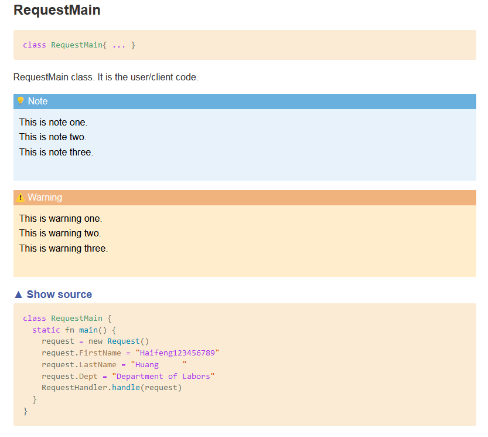

# 弃用通知
此项目已不再维护，所有内容已经移至[magpie](https://github.com/haifenghuang/magpie)。


# Monkey程序语言

Table of Contents
=================

* [Monkey程序语言](#monkey%E7%A8%8B%E5%BA%8F%E8%AF%AD%E8%A8%80)
  * [主页](#%E4%B8%BB%E9%A1%B5)
  * [概述](#%E6%A6%82%E8%BF%B0)
  * [总览](#%E6%80%BB%E8%A7%88)
  * [安装](#%E5%AE%89%E8%A3%85)
  * [基本用法](#%E5%9F%BA%E6%9C%AC%E7%94%A8%E6%B3%95)
  * [语言之旅](#%E8%AF%AD%E8%A8%80%E4%B9%8B%E6%97%85)
    * [注释](#%E6%B3%A8%E9%87%8A)
    * [数据类型](#%E6%95%B0%E6%8D%AE%E7%B1%BB%E5%9E%8B)
    * [常量(字面值)](#%E5%B8%B8%E9%87%8F%E5%AD%97%E9%9D%A2%E5%80%BC)
    * [变量](#%E5%8F%98%E9%87%8F)
    * [保留字](#%E4%BF%9D%E7%95%99%E5%AD%97)
    * [类型转换](#%E7%B1%BB%E5%9E%8B%E8%BD%AC%E6%8D%A2)
    * [qw(Quote word)关键字](#qwquote-word%E5%85%B3%E9%94%AE%E5%AD%97)
    * [enum关键字](#enum%E5%85%B3%E9%94%AE%E5%AD%97)
    * [元操作符(Meta\-Operators)](#%E5%85%83%E6%93%8D%E4%BD%9C%E7%AC%A6meta-operators)
    * [控制流程](#%E6%8E%A7%E5%88%B6%E6%B5%81%E7%A8%8B)
    * [using语句](#using%E8%AF%AD%E5%8F%A5)
    * [用户自定义操作符](#%E7%94%A8%E6%88%B7%E8%87%AA%E5%AE%9A%E4%B9%89%E6%93%8D%E4%BD%9C%E7%AC%A6)
    * [整型(Integer)](#%E6%95%B4%E5%9E%8Binteger)
    * [浮点型(Float)](#%E6%B5%AE%E7%82%B9%E5%9E%8Bfloat)
    * [Decimal类型](#decimal%E7%B1%BB%E5%9E%8B)
    * [数组(Array)](#%E6%95%B0%E7%BB%84array)
    * [字符串(String)](#%E5%AD%97%E7%AC%A6%E4%B8%B2string)
    * [哈希(Hash)](#%E5%93%88%E5%B8%8Chash)
    * [元祖(Tuple)](#%E5%85%83%E7%A5%96tuple)
    * [类](#%E7%B1%BB)
      * [继承和多态](#%E7%BB%A7%E6%89%BF%E5%92%8C%E5%A4%9A%E6%80%81)
      * [操作符重载](#%E6%93%8D%E4%BD%9C%E7%AC%A6%E9%87%8D%E8%BD%BD)
      * [属性(类似C\#)](#%E5%B1%9E%E6%80%A7%E7%B1%BB%E4%BC%BCc)
      * [索引器](#%E7%B4%A2%E5%BC%95%E5%99%A8)
      * [静态变量/方法/属性](#%E9%9D%99%E6%80%81%E5%8F%98%E9%87%8F%E6%96%B9%E6%B3%95%E5%B1%9E%E6%80%A7)
      * [类类别(class category)](#%E7%B1%BB%E7%B1%BB%E5%88%ABclass-category)
      * [注解](#%E6%B3%A8%E8%A7%A3)
    * [标准输入/输出/错误](#%E6%A0%87%E5%87%86%E8%BE%93%E5%85%A5%E8%BE%93%E5%87%BA%E9%94%99%E8%AF%AF)
    * [标准库中的错误处理](#%E6%A0%87%E5%87%86%E5%BA%93%E4%B8%AD%E7%9A%84%E9%94%99%E8%AF%AF%E5%A4%84%E7%90%86)
    * [关于defer关键字](#%E5%85%B3%E4%BA%8Edefer%E5%85%B3%E9%94%AE%E5%AD%97)
    * [不同类型的联接](#%E4%B8%8D%E5%90%8C%E7%B1%BB%E5%9E%8B%E7%9A%84%E8%81%94%E6%8E%A5)
    * [列表推导(Comprehensions)](#%E5%88%97%E8%A1%A8%E6%8E%A8%E5%AF%BCcomprehensions)
    * [Grep和map](#grep%E5%92%8Cmap)
    * [函数](#%E5%87%BD%E6%95%B0)
    * [Pipe操作符](#pipe%E6%93%8D%E4%BD%9C%E7%AC%A6)
    * [Spawn 和 channel](#spawn-%E5%92%8C-channel)
  * [使用go语言模块](#%E4%BD%BF%E7%94%A8go%E8%AF%AD%E8%A8%80%E6%A8%A1%E5%9D%97)
  * [标准模块介绍](#%E6%A0%87%E5%87%86%E6%A8%A1%E5%9D%97%E4%BB%8B%E7%BB%8D)
    * [fmt 模块](#fmt-%E6%A8%A1%E5%9D%97)
    * [time 模块](#time-%E6%A8%A1%E5%9D%97)
    * [logger 模块](#logger-%E6%A8%A1%E5%9D%97)
    * [flag 模块(处理命令行选项)](#flag-%E6%A8%A1%E5%9D%97%E5%A4%84%E7%90%86%E5%91%BD%E4%BB%A4%E8%A1%8C%E9%80%89%E9%A1%B9)
    * [json 模块( json序列化(marshal)和反序列化(unmarshal) )](#json-%E6%A8%A1%E5%9D%97-json%E5%BA%8F%E5%88%97%E5%8C%96marshal%E5%92%8C%E5%8F%8D%E5%BA%8F%E5%88%97%E5%8C%96unmarshal-)
    * [net 模块](#net-%E6%A8%A1%E5%9D%97)
    * [linq 模块](#linq-%E6%A8%A1%E5%9D%97)
    * [Linq for file支持](#linq-for-file%E6%94%AF%E6%8C%81)
    * [csv 模块](#csv-%E6%A8%A1%E5%9D%97)
    * [template 模块](#template-%E6%A8%A1%E5%9D%97)
    * [sql 模块](#sql-%E6%A8%A1%E5%9D%97)
  * [实用工具](#%E5%AE%9E%E7%94%A8%E5%B7%A5%E5%85%B7)
  * [文档生成](#%E6%96%87%E6%A1%A3%E7%94%9F%E6%88%90)
  * [语法高亮](#%E8%AF%AD%E6%B3%95%E9%AB%98%E4%BA%AE)
  * [未来计划](#%E6%9C%AA%E6%9D%A5%E8%AE%A1%E5%88%92)
  * [许可证](#%E8%AE%B8%E5%8F%AF%E8%AF%81)
  * [备注](#%E5%A4%87%E6%B3%A8)

## 主页

[monkey](https://github.com/haifenghuang/monkey)

## 概述

Monkey是一个用go语言写的解析器. 语法借鉴了C, Ruby, Python, Perl和C#.
支持常用的控制流程，函数式编程和面向对象编程。
同时它还包括一个实时语法高亮的REPL。

下面是一个使用monkey语言的示例程序:

```swift

//声明注解，注解的body中必须是属性，不能是方法
class @MinMaxValidator {
  property MinLength
  property MaxLength default 10 //Same as 'property MaxLength = 10'
}

//Marker annotation
class @NoSpaceValidator {}

class @DepartmentValidator {
  property Department
}

//这个是请求类，我们对这个类使用注解
class Request {
  @MinMaxValidator(MinLength=1)
  property FirstName; //这种方式声明的属性，默认为可读可写。等价于'property FirstName { get; set; }'

  @NoSpaceValidator
  property LastName;

  @DepartmentValidator(Department=["Department of Education", "Department of Labors"])
  property Dept;
}

//处理注解的类
class RequestHandler {
  static fn handle(o) {
    props = o.getProperties()
    for p in props {
      annos = p.getAnnotations()
      for anno in annos {
        if anno.instanceOf(MinMaxValidator) {
          //p.value表示属性的值
          if len(p.value) > anno.MaxLength || len(p.value) < anno.MinLength {
            printf("Property '%s' is not valid!\n", p.name)
          }
        } elseif anno.instanceOf(NoSpaceValidator) {
          for c in p.value {
            if c == " " || c == "\t" {
              printf("Property '%s' is not valid!\n", p.name)
              break
            }
          }
        } elseif anno.instanceOf(DepartmentValidator) {
          found = false
          for d in anno.Department {
            if p.value == d {
              found = true
            }
          }
          if !found {
            printf("Property '%s' is not valid!\n", p.name)
          }
        }
      }
    }
  }
}

class RequestMain {
  static fn main() {
    request = new Request();
    request.FirstName = "Haifeng123456789"
    request.LastName = "Huang     "
    request.Dept = "Department of Labors"
    RequestHandler.handle(request);
  }
}

RequestMain.main()
```

下面是处理结果：

```
Property 'FirstName' is not valid!
Property 'LastName' is not valid!
```

下面是一个实时语法高亮REPL:


下面是使用mdoc生成的html文档:



## 总览

此项目是基于mayoms的项目 [monkey](https://github.com/mayoms/monkey)，修改了其中的一些bug，同时增加了许多语言特性：
* 增加了简单面向对象（oop)支持(索引器，操作符重载，属性，static方法,注解)
* 更改了`string`模块(能够正确处理utf8字符编码)
* 修改了`file`模块(包含一些新方法).
* 增加了`math`，`time`, `sort`, `os`, `log`, `net`, `http`, `filepath`, `fmt`, `sync`, `list`, `csv`, `regexp`, `template`, 模块等
* `sql(db)`模块(能够正确的处理`null`值)
* `flag`模块(用来处理命令行参数)
* `json`模块(json序列化和反序列化)
* `linq`模块(代码来自[linq](https://github.com/ahmetb/go-linq)并进行了相应的更改)
* 增加了`decimal`模块(代码来自[decimal](https://github.com/shopspring/decimal)并进行了相应的小幅度更改)
* 正则表达式支持(部分类似于perl)
* 管道(channel)(基于go语言的channel)
* 更多的操作符支持(&&, ||, &, |, ^, +=, -=, ?:, ??等等)
* utf8支持(例如，你可以使用utf8字符作为变量名)
* 更多的流程控制支持(例如: try/catch/finally, for-in, case-in, 类似c语言的for循环)
* defer支持
* spawn支持(goroutine)
* enum支持
* `using`支持(类似C#的using)
* pipe操作符支持
* 支持可变参数和缺省参数的函数
* 支持列表推导(list comprehension)和哈希推导(hash comprehension)
* 支持用户自定义操作符
* 使用Go Package的方法(`RegisterFunctions`和`RegisterVars`)

这个项目的目的主要有以下几点：

* 自学go语言
* 了解解析器的工作原理

但是，解析器的速度并不是这个项目考虑的因素

## 安装

下载本项目，运行`./run.sh`

## 基本用法

你可以如下方式使用REPL:

```sh
~ » monkey
Monkey programming language REPL

>>
```

或者运行一个monkey文件:

```sh
monkey path/to/file
```

## 语言之旅

### 注释

Monkey支持两种形式的单行注释和块注释：

```swift
// a single line comment
# another single line comment

/* This is a 
   block comment.
*/
```

同时也支持块注释

### 数据类型

Monkey支持9种基本类型: `String`, `Int`, `UInt`, `Float`, `Bool`, `Array`, `Hash`, `Tuple`和`Nil`

```swift
s1 = "hello, 黄"       # strings are UTF-8 encoded
s2 = `hello, "world"`  # raw string
i = 10                 # int
u = 10u                # uint
f = 10.0               # float
b = true               # bool
a = [1, "2"]           # array
h = {"a": 1, "b": 2}   # hash
t = (1,2,3)            # tuple
n = nil
```

### 常量(字面值)

Monkey中，主要有11种类型的常量(字面量).

* Integer
* UInteger
* Float
* String
* 正则表达式
* Array
* Hash
* Tuple
* Nil
* Boolean
* Function

```swift
// Integer literals
i1 = 10
i2 = 20_000_000
i3 = 0x80           // hex
i4 = 0b10101        // binary
i5 = 0o127          // octal

// Unsigned Integer literals
ui1 = 10u
ui2 = 20_000_000u     //for more readable
ui3 = 0x80u           // hex
ui4 = 0b10101u        // binary
ui5 = 0o127u          // octal

// Float literals
f1 = 10.25
f2 = 1.02E3
f3 = 123_456.789_012

// String literals
s1 = "123"
s2 = "Hello world"

// Regular expression literals
r = /\d+/.match("12")
if (r) { prinln("regex matched!") }

// Array literals
a = [1+2, 3, 4, "5", 3]

// Hash literals
h = { "a": 1, "b": 2, "c": 2}

//Tuple literals
t = (1, 2+3, "Hello", 5)

// Nil literal
n = nil

// Boolean literals
t = true
f = false

// Function literals
let f1 = add(x, y) { return x + y }
println(f1(1,2))

//fat-arrow function literals
let f2 = (x, y) => x + y
println(f2(1,2))
```

### 变量

你可以使用`let`来声明一个变量，或直接使用赋值的方式来声明并赋值一个变量:`variable=value`.

```swift
let a, b, c = 1, "hello world", [1,2,3]
d = 4
e = 5
姓="黄"
```
你还可以使用`解构赋值`(Destructuring assignment), 当使用这种方法的时候，等号左边的变量必须用‘()’包起来:

```swift
//等号右边为数组
let (d,e,f) = [1,5,8]
//d=1, e=5, f=8

//等号右边为元祖
let (g, h, i) = (10, 20, "hhf")
//g=10, h=20, i=hhf

//等号右边为哈希
let (j, k, l) = {"j": 50, "l": "good"}
//j=50, k=nil, l=good

```

如果你不使用`let`来给变量赋值，那么你将不能使用多变量赋值。下面的语句是错误的：

```swift
//错误,多变量赋值必须使用let关键字
a, b, c = 1, "hello world", [1,2,3]
```

注：从Monkey 5.0开始，`let`的含义有所变化，如果声明的变量已经存在，给变量赋值的时候就会覆盖原来的值：

```swift
let x, y = 10, 20;
let x, y = y, x //交换两个变量的值
printf("x=%v, y=%v\n", x, y)  //结果：x=20, y=10
```
`let`还支持使用占位符(_), 如果给占位符赋了一个值，占位符会忽略这个值：

```swift
let x, _, y = 10, 20, 30
printf("x=%d, y=%d\n", x, y) //结果：x=10, y=30
```

### 保留字

下面列出了monkey语言的保留字：

* fn
* let
* true false nil
* if elsif elseif elif else
* unless
* return
* include
* and or
* enum
* struct # 保留,暂时没使用
* do while for break continue where
* grep map
* case is in
* try catch finally throw
* defer
* spawn
* qw
* using
* class new property set get static default
* interface public private protected #保留,暂时没使用


### 类型转换

你可以使用内置的方法：`int()`, `uint()`, `float()`, `str()`, `array()`, `tuple`, `hash`, `decimal`来进行不同类型之间的转换.

```swift
let i = 0xa
let u = uint(i)                 // result: 10
let s = str(i)                  // result: "10"
let f = float(i)                // result: 10
let a = array(i)                // result: [10]
let t = tuple(i)                // result: (10,)
let h = hash(("key", "value"))  // result: {"key": "value}
let d = decimal("123.45634567") // result: 123.45634567
```

你可以从一个数组创建一个tuple:

```swift
let t = tuple([10, 20])   //result:(10,20)
```

同样的, 你也可以从一个tuple创建一个数组:

```swift
let arr = array((10,20))  //result:[10,20]
```

你只能从数组或者tuple来创建一个hash:

```swift
//创建一个空的哈希
let h1 = hash()  //same as h1 = {}

//从数组创建哈希
let h1 = hash([10, 20])     //result: {10 : 20}
let h2 = hash([10,20,30])   //result: {10 : 20, 30 : nil}

//从tuple创建哈希
let h3 = hash((10, 20))     //result: {10 : 20}
let h4 = hash((10,20,30))   //result: {10 : 20, 30 : nil}
```

### `qw`(Quote word)关键字

`qw`关键字类似perl的`qw`关键字. 当你想使用很多的双引号字符串时,`qw`就是一个好帮手.

```swift
for str in qw<abc, def, ghi, jkl, mno> { //允许的成对操作符：'{}', '<>', '()'
  println('str={str}')
}

newArr = qw(1,2,3.5) //注：这里的newArr是一个字符串数组，不是一个整形数组.
fmt.printf("newArr=%v\n", newArr)
```

### `enum`关键字

在mokey中，你可以使用`enum`来定义常量.

```swift
LogOption = enum {
    Ldate         = 1 << 0,
    Ltime         = 1 << 1,
    Lmicroseconds = 1 << 2,
    Llongfile     = 1 << 3,
    Lshortfile    = 1 << 4,
    LUTC          = 1 << 5,
    LstdFlags     = 1 << 4 | 1 << 5
}

opt = LogOption.LstdFlags
println(opt)

//得到`enum`的所有名称
for s in LogOption.getNames() { //非排序(non-ordered)
    println(s)
}

//得到`enum`的所有值
for s in LogOption.getValues() { //非排序(non-ordered)
    println(s)
}

// 得到`enum`的一个特定的名字
println(LogOption.getName(LogOption.Lshortfile))
```

### 元操作符(Meta-Operators)
Monkey内嵌了一些类似Perl6的元操作符。
但是对于元操作符有严格的限制：

* 元操作符只能针对数组进行操作
* 元操作符操作的数组中的所有元素必须是数字(uint, int, float)或者字符串
* 元操作符是中缀元操作符的时候，如果两边都是数组的话，数组元素必须相等

```swift
let arr1 = [1,2,3] ~* [4,5,6]
let arr2 = [1,2,3] ~* 4
let arr3 = [1,2,"HELLO"] ~* 2
let value1 = ~*[10,2,2]
let value2 = ~+[2,"HELLO",2]

println(arr1)   //结果：[4, 10, 18]
println(arr2)   //结果：[4, 8, 12]
println(arr3)   //结果：[2,4,"HELLOHELLO"]
println(value1) //结果：40
println(value2) //结果：2HELLO2
```

目前为止，Monkey中有六个元操作符：
* <p>~+</p>
* <p>~-</p>
* <p>~*</p>
* <p>~/</p>
* <p>~%</p>
* <p>~^</p>

这六个元操作符既可以作为中缀表达式，也可以作为前缀表达式。

元操作符作为中缀表达式返回的结果为数组类型。
元操作符作为前缀表达式返回的结果为值类型(uint, int, float, string)。


下面的表格列出了相关的元操作符及其含义(只列出了`~+`)：
<table>
  <tr>
    <th>元操作符</td>
    <th>表达式</td>
    <th>举例</td>
    <th>结果</td>
  </tr>
  <tr>
    <td>~+</td>
    <td>中缀表达式</td>
    <td>[x1, y1, z1] ~+ [x2, y2, z2]</td>
    <td>[x1+x2, y1+y2, z1+z2] (数组)</td>
  </tr>
  <tr>
    <td>~+</td>
    <td>中缀表达式</td>
    <td>[x1, y1, z1] ~+ 4</td>
    <td>[x1+4, y1+4, z1+4] (数组)</td>
  </tr>
  <tr>
    <td>~+</td>
    <td>前缀表达式</td>
    <td>~+[x1, y1, z1]</td>
    <td>x1+y1+z1 (注：数值， 非数组)</td>
  </tr>
</table>

### 控制流程

* if/if-else/if-elif-else/if-elsif-else/if-elseif-else/if-else if-else
* unless/unless-else
* for/for-in
* while
* do
* try-catch-finally
* case-in/case-is

```swift
// if-else
let a, b = 10, 5
if (a > b) {
    println("a > b")
}
elseif a == b { // 也可以使用'elsif', 'elseif'和'elif'
    println("a = b")
}
else {
    println("a < b")
}

//unless-else
unless b > a {
    println("a >= b")
} else {
    println("b > a")
}

// for
i = 9
for { // 无限循环
    i = i + 2
    if (i > 20) { break }
    println('i = {i}')
}


i = 0
for (i = 0; i < 5; i++) {  // 类似c语言的for循环， '()'必须要有
    if (i > 4) { break }
    if (i == 2) { continue }
    println('i is {i}')
}

i = 0
for (; i < 5; i++) {  // 无初期化语句
    if (i > 4) { break }
    if (i == 2) { continue }
    println('i is {i}')
}

i = 0
for (; i < 5;;) {  // 无初期化和更新语句
    if (i > 4) { break }
    if (i == 2) { continue }
    println('i is {i}')
    i++ //更新语句
}

i = 0
for (;;;) {  // 等价于'for { block }'语句
    if (i > 4) { break }
    println('i is {i}')
    i++ //更新语句
}

for i in range(10) {
    println('i = {i}')
}

a = [1,2,3,4]
for i in a where i % 2 != 0 {
    println(i)
}


hs = {"a":1, "b":2, "c":3, "d":4, "e":5, "f":6, "g":7}
for k, v in hs where v % 2 == 0 {
    println('{k} : {v}')
}


for i in 1..5 {
    println('i={i}')
}

for item in 10..20 where $_ % 2 == 0 { // $_ is the index
    printf("idx=%d, item=%d\n", $_, item)
}


for c in "m".."a" {
    println('c={c}')
}


for idx, v in "abcd" {
    printf("idx=%d, v=%s\n", idx, v)
}


for idx, v in ["a", "b", "c", "d"] {
    printf("idx=%d, v=%s\n", idx, v)
}

for item in ["a", "b", "c", "d"] where $_ % 2 == 0 { // $_ 是索引
    printf("idx=%d, item=%s\n", $_, v)
}


//for循环是个表达式(expression),而不是一个语句(statement), 因此它能够被赋值给一个变量
let plus_one = for i in [1,2,3,4] { i + 1 }
fmt.println(plus_one)

// while
i = 10
while (i>3) {
    i--
    println('i={i}')
}

// do
i = 10
do {
    i--
    if (i==3) { break }
}

// try-catch-finally(仅支持throw一个string类型的变量)
let exceptStr = "SUMERROR"
try {
    let th = 1 + 2
    if (th == 3) { throw exceptStr }
}
catch "OTHERERROR" {
    println("Catched OTHERERROR")
}
catch exceptStr {
    println("Catched is SUMERROR")
}
catch {
    println("Catched ALL")
}
finally {
    println("finally running")
}

// case-in/case-is
let testStr = "123"
case testStr in { // in(完全或部分匹配), is(完全匹配)
    "abc", "mno" { println("testStr is 'abc' or 'mno'") }
    "def"        { println("testStr is 'def'") }
    `\d+`        { println("testStr contains digit") }
    else         { println("testStr not matched") }
}

let i = [{"a":1, "b":2}, 10]
let x = [{"a":1, "b":2},10]
case i in {
    1, 2 { println("i matched 1, 2") }
    3    { println("i matched 3") }
    x    { println("i matched x") }
    else { println("i not matched anything")}
}

```

### `using`语句
在Monkey中，如果你有一些资源需要释放(release/free/close)，例如关闭文件，释放网络连接等等，
你可以使用类似`c#`的`using`语句。

```swift
// 这里，我们使用'using'语句，因此你不必显示调用infile.close()。
// 当'using'语句执行完后，Monkey解析器会隐式调用infile.close()。
using (infile = newFile("./file.demo", "r")) {
    if (infile == nil) {
        println("opening 'file.demo' for reading failed, error:", infile.message())
        os.exit(1)
    }

    let line;
    let num = 0
    //Read file by using extraction operator(">>")
    while (infile>>line != nil) {
        num++
        printf("%d	%s\n", num, line)
    }
}
```

### 用户自定义操作符
在Monkey中， 你可以自定义一些操作符， 但是你不能覆盖Monkey内置的操作符。

> 注: 并不是所有的操作符都可以自定义。

下面的例子展示了如何使用自定义操作符：

```swift
//中缀运算符'=@'接受两个参数
fn =@(x, y) {
    return x + y * y
}

//前缀运算符'=^'仅接受一个参数
fn =^(x) {
    return -x
}

let pp = 10 =@ 5 // 使用用户自定义的中缀运算符'=@'
printf("pp=%d\n", pp) // 结果： pp=35

let hh = =^10 // 使用用户自定义的前缀运算符'=^'
printf("hh=%d\n", hh) // 结果： hh=-10
```

```swift
fn .^(x, y) {
    arr = []
    while x <= y {
        arr += x
        x += 2
    }
    return arr
}

let pp = 10.^20
printf("pp=%v\n", pp) // result: pp=[10, 12, 14, 16, 18, 20]
```

下面的表格列出了Monkey内置的运算符和用户可以自定义的运算符：

<table>
  <tr>
    <th>内置运算符</td>
    <th>用户自定义运算符</td>
  </tr>
  <tr>
    <td>==<br/>=~<br/>=></td>
    <td>=X</td>
  </tr>
  <tr>
    <td>++<br/>+=</td>
    <td>+X</td>
  </tr>
  <tr>
    <td>--<br/>-=<br/>-></td>
    <td>-X</td>
  </tr>
  <tr>
    <td>&gt;=<br/>&lt;&gt;</td>
    <td>&gt;X</td>
  </tr>
  <tr>
    <td>&lt;=<br/>&lt;&lt;</td>
    <td>&lt;X</td>
  </tr>
  <tr>
    <td>!=<br/>!~</td>
    <td>!X</td>
  </tr>
  <tr>
    <td>*=<br/>**</td>
    <td>*X</td>
  </tr>
  <tr>
    <td>..<br/>..</td>
    <td>.X</td>
  </tr>
  <tr>
    <td>&amp;=<br/>&amp;&amp;</td>
    <td>&amp;X</td>
  </tr>
  <tr>
    <td>|=<br/>||</td>
    <td>|X</td>
  </tr>
  <tr>
    <td>^=</td>
    <td>^X</td>
  </tr>
</table>

> 在上面的表格中，`X`可以是`.=+-*/%&,|^~<,>},!?@#$`。


### 整型(Integer)

在Monkey中，整型也是一个对象。因此，你可以调用这个对象的方法。请看下面的例子：

```swift
x = (-1).next()
println(x) //0

x = -1.next() //equals 'x = -(1.next())
println(x) //-2

x = (-1).prev()
println(x) //-2

x = -1.prev() //equals 'x = -(1.prev())
println(x) //0

x = [i for i in 10.upto(15)]
println(x) //[10, 11, 12, 13, 14, 15]

for i in 10.downto(5) {
    print(i, "") //10 9 8 7 6 5

}
println()

if 10.isEven() {
    println("10 is even")
}

if 9.isOdd() {
    println("9 is odd")
}
```

### 浮点型(Float)

在Monkey中，浮点型也是一个对象。因此，你可以调用这个对象的方法。请看下面的例子：

```swift
f0 = 15.20
println(f0)

f1 = 15.20.ceil()
println(f1)

f2 = 15.20.floor()
println(f2)
```

### Decimal类型

在Monkey中，Decimal类型表示一个任意精度固定位数的十进数(Arbitrary-precision fixed-point decimal numbers).
这个类型的代码主要是基于[decimal](https://github.com/shopspring/decimal).

请看下面的例子：

```swift
d1 = decimal.fromString("123.45678901234567")  //从字符串创建Decimal类型
d2 = decimal.fromFloat(3)  //从浮点型创建Decimal类型

//设置除法精度(division precision).
//注意: 这个操作将会影响所有后续对Decimal类型的运算
decimal.setDivisionPrecision(50)

fmt.println("123.45678901234567/3 = ", d1.div(d2))  //打印 d1/d2
fmt.println(d1.div(d2)) //效果同上

fmt.println(decimal.fromString("123.456").trunc(2))

//将字符串转换为decimal
d3=decimal("123.45678901234567")
fmt.println(d3)
fmt.println("123.45678901234567/3 = ", d3.div(d2))
```

### 数组(Array)

在Monkey中, 你可以使用[]来初始化一个空的数组:

```swift
emptyArr = []
emptyArr[3] = 3 //将会自动扩容
println(emptyArr)
```
你可以使用两种方式来创建一个给定长度的数组:

```swift
//创建一个有10个元素的数组(默认值为nil)
//Note: this only support integer literal.
let arr = []10
println(arr)

//使用内置'newArray'方法.
let anotherArr = newArray(len(arr))
println(anotherArr)

println(anotherArr) //结果: [nil, nil, nil, nil, nil, nil, nil, nil, nil, nil]

let arr1 = ["1","a5","5", "5b","4","cc", "7", "dd", "9"]
let arr2 = newArray(6, arr1, 10, 11, 12) //第一个参数为数组size
println(arr2) //结果: ["1", "a5", "5", "5b", "4", "cc", "7", "dd", "9", 10, 11, 12]

let arr3 = newArray(20, arr1, 10, 11, 12)
println(arr3) //结果 : ["1", "a5", "5", "5b", "4", "cc", "7", "dd", "9", 10, 11, 12, nil, nil, nil, nil, nil, nil, nil, nil]
```

数组可以包含任意数据类型的元素。

```swift
mixedArr = [1, 2.5, "Hello", ["Another", "Array"], {"Name":"HHF", "SEX":"Male"}]
```
注: 最后关闭方括弧(']')前的逗号(',’)是可以省略的。

你可以使用索引来访问数组元素。

```swift
println('mixedArr[2]={mixedArr[2]}')
println(["a", "b", "c", "d"][2])
```

因为数组是一个对象, 因此你可以使用对象方法来操作它。

```swift
if ([].empty()) {
    println("array is empty")
}

emptyArr.push("Hello")
println(emptyArr)

//你可以使用'加算(+=)'的方式来向数组中添加一个元素:
emptyArr += 2
println(emptyArr)

//你还可以使用`<<(插入操作符)`的方式来向数组中添加一个元素,插入操作符支持链式操作。
emptyArr << 2 << 3
println(emptyArr)
```

可以使用`for`循环来遍历一个数组。

```swift
numArr = [1,3,5,2,4,6,7,8,9]
for item in numArr where item % 2 == 0 {
    println(item)
}

let strArr = ["1","a5","5", "5b","4","cc", "7", "dd", "9"]
for item in strArr where /^\d+/.match(item) {
    println(item)
}

for item in ["a", "b", "c", "d"] where $_ % 2 == 0 {  //$_是索引
    printf("idx=%d, v=%s\n", $_, item)
}
```

你可以使用内置函数`reverse`来反转数组元素:

```swift
let arr = [1,3,5,2,4,6,7,8,9]
println("Source Array =", arr)

revArr = reverse(arr)
println("Reverse Array =", revArr)
```

数组还支持使用`数组乘法运算符`（*）:

```swift
let arr = [3,4] * 3
println(arr) // 结果: [3,4,3,4,3,4]
```

### 字符串(String)

在monkey中, 有三种类型的`string`:

* 原生字符串(可包含`\n`)
* 双引号字符串(不可包含`\n`)
* 单引号字符串(可解析字符串)

原生字符串是一系列字符序列。使用反引号(``)来表示. 在原生字符串中，除了不能使用反引号外，你可以使用其它的任意字符。

请看下面的例子:

```swift
normalStr = "Hello " + "world!"
println(normalStr)

println("123456"[2])

rawStr = `Welcome to
visit us!`
println(rawStr)

//当你希望一个变量在字符串中也能够被解析时，你可以使用单引号。
//需要被解析的字符串放在花括号('{}')中:
str = "Hello world"
println('str={str}') //输出: "Hello world"
str[6]="W"
println('str={str}') //输出: "Hello World"

```

在monkey中, 字符串是utf8编码的, 这说明你可以使用utf8编码的字符作为变量名：

```swift
三 = 3
五 = 5
println(三 + 五) //输出 : 8
```

字符串也是对象，你可以使用`strings`模块中的方法来操作字符串：

```swift
upperStr = "hello world".upper()
println(upperStr) //输出 : HELLO WORLD
```

字符串也可以被遍历:

```swift
for idx, v in "abcd" {
    printf("idx=%d, v=%s\n", idx, v)
}

for v in "Hello World" {
    printf("idx=%d, v=%s\n", $_, v) //$_是索引
}
```

你可以连接一个对象到字符串:

```swift
joinedStr = "Hello " + "World"
joinedStr += "!"
println(joinedStr)
```

你还可以使用内置函数`reverse`来反转字符串：

```swift
let str = "Hello world!"
println("Source Str =", str)
revStr = reverse(str)
println("Reverse str =", revStr)
```

如果你希望将一个包含数字的字符串转换为数字，你可以在字符串之前加入"+“号，将此字符串转换为数字：

```swift
a = +"121314" // a是一个整数
println(a) // 结果：121314

// 整数支持"0x"(十六进制), "0b"(二进制), "0o"(八进制)前缀
a = +"0x10" // a是一个整数
println(a) // 结果：16

a = +"121314.6789" // a是一个浮点数
println(a) // 结果：121314.6789
```

### 哈希(Hash)
在monkey中，哈希默认会保持Key的插入顺序，类似Python的orderedDict.

你可以使用{}来创建一个空的哈希:

```swift
emptyHash = {}
emptyHash["key1"] = "value1"
println(emptyHash)
```

哈希的键(key)可以是字符串(string)，整型(int)或布尔型(boolean):

```swift
hashObj = {
    12     : "twelve",
    true   : 1,
    "Name" : "HHF"
}
hash["age"] = 12 // same as hash.age = 12
println(hashObj)
```

注: 最后关闭花括弧('}')前的逗号(',’)是可以省略的。

你还可以使用'+'或'-'来从一个哈希中增加或者删除一个元素:

```swift
hashObj += {"key1" : "value1"}
hashObj += {"key2" : "value2"}
hashObj += {5 : "five"}
hashObj -= "key2"
hashObj -= 5
println(hash)
```

哈希也是一个对象,你可以使用`hash`模块中的方法来操作哈希:

```swift

hashObj.push(15, "fifteen") //第一个参数是键，第二个参数是值
hashObj.pop(15)

keys = hashObj.keys()
println(keys)

values = hashObj.values()
println(values)
```

你还可以使用内置函数`reverse`来反转哈希的key和value:

```swift
let hs = {"key1":12, "key2":"HHF", "key3":false}
println("Source Hash =", hs)
revHash = reverse(hs)
println("Reverse Hash =", revHash)
```

### 元祖(Tuple)

在Monkey中, `tuple`与数组非常类似, 但一旦你创建了一个元祖，你就不能够更改它。

Tuples使用括号来创建:

```swift
//创建一个空元祖
let t1 = tuple()

//效果同上
let t2 = ()

// 创建仅有一个元素的元祖.
// 注意: 结尾的","是必须的，否则将会被解析为(1), 而不是元祖
let t3 = (1,)

//创建有两个元素的元祖
let t4 = (2,3)
```

你可以使用内置函数`tuple`，将任何类型的对象装换为元祖。

```swift
let t = tuple("hello")
println(t)  // 结果: ("hello")
```

类似于数组, 元祖也可以被索引(indexed)，或切片(sliced)。
索引表达式`tuple[i]`返回第i个索引位置的元祖元素, 切片表达式
tuple[i:j]返回一个子元祖.

```swift
let t = (1,2,3)[2]
print(t) // result:3
```

元祖还可以被遍历(类似数组)，所以元祖可以使用在for循环中，用在
列表推导中。

```swift
//for循环
for i in (1,2,3) {
    println(i)
}

//元祖推导(comprehension)
let t1 =  [x+1 for x in (2,4,6)]
println(t1) //result: [3, 5, 7]. 注意: 结果是数组，不是元祖
```

与数组不同，元祖不能够被修改。但是元祖内部的可变元素是可以被修改的.

```swift
arr1 = [1,2,3]
t = (0, arr1, 5, 6)
println(t)    // 结果: (0, [1, 2, 3], 5, 6)
arr1.push(4)
println(t)    //结果:  (0, [1, 2, 3, 4], 5, 6)
```

元祖也可以用作哈希的键。

```swift
key1=(1,2,3)
key2=(2,3,4)
let ht = {key1 : 10, key2 : 20}
println(ht[key1]) // result: 10
println(ht[key2]) // result: 20
```

元祖可以使用`+`来连接，它会创建一个新的元祖。

```swift
let t = (1, 2) + (3, 4)
println(t) // 结果: (1, 2, 3, 4)
```

如果将元祖用在布尔环境中，那么如果元祖的元素数量大于0， 那么返回结果是true。

```swift
let t = (1,)
if t {
    println("t is not empty!")
} else {
    println("t is empty!")
}

//结果 : "t is not empty!"
```

元祖的json序列化(反序列化)的结果都为数组，而不是元祖

```swift
let tupleJson = ("key1","key2")
let tupleStr = json.marshal(tupleJson)
//结果:  [
//        "key1"，
//        "key2"，
//       ]
println(json.indent(tupleStr, "  "))

let tupleJson1 = json.unmarshal(tupleStr)
println(tupleJson1) //结果: ["key1", "key2"]
```

元祖与一个数组相加，返回结果为一个数组，而不是元祖.

```swift
t2 = (1,2,3) + [4,5,6]
println(t2) // 结果: [(1, 2, 3), 4, 5, 6]
```

你也可以使用内置函数`reverse`来反转元祖中的元素:

```swift
let tp = (1,3,5,2,4,6,7,8,9)
println(tp) //结果: (1, 3, 5, 2, 4, 6, 7, 8, 9)

revTuple = reverse(tp)
println(revTuple) //结果: (9, 8, 7, 6, 4, 2, 5, 3, 1)
```

### 类

Monkey支持简单的面向对象编程, 下面列出了Mokey支持的特性：

* 继承和多态
* 操作符重载
* 属性(getter和setter)
* 静态变量/方法/属性
* 索引器
* 类类别(类似Objective-c的Category)
* 注解（类似java的annotation）
* 类的构造器方法和类的普通方法支持多参数和默认参数

monkey解析器(parser)能够正确的处理关键字`public`, `private`, `protected`, 但是解释器(evaluator)会忽略这些。
也就是说，monkey现在暂时不支持访问限定。

你可以使用`class`关键字来声明一个类，使用`new Class(xxx)`来创建一个类的实例。

```swift
class Animal {
    let name = ""
    fn init(name) {    //'init'是构造方法
        //do somthing
    }
}
```

在monkey中，所有的类都继承于`object`根类。`object`根类包含几个所有类的共通方法。比如`toString()`, `instanceOf()`, `is_a()`, `classOf()`, `hashCode`。
`instanceOf()`等价于`is_a()`

下面的代码和上面的代码等价:

```swift
class Animal : object {
    let name = ""
    fn init(name) {    //'init'是构造方法
        //do somthing
    }
}
```

#### 继承和多态

你使用`:`来表示继承关系:

```swift
class Dog : Animal { //Dog类继承于Animal类
}
```

在子类中，你可以使用`parent`来访问基类的方法和字段。

请看下面的例子:

```swift
class Animal {
    let Name;

    fn MakeNoise()
    {
        println("generic noise")
    }
    fn ToString()
    {
        return "oooooooo"
    }
}

class Cat : Animal {
    fn init(name)
    {
        this.Name = name
    }

    fn MakeNoise()
    {
        println("Meow")
    }

    fn ToString()
    {
        return Name + " cat"
    }
}

class Dog : Animal {
    fn init(name)
    {
        this.Name = name
    }

    fn MakeNoise()
    {
        println("Woof!")
    }

    fn ToString()
    {
        return Name + " dog"
    }

    fn OnlyDogMethod()
    {
        println("secret dog only method")
    }
}


cat = new Cat("pearl")
dog = new Dog("cole")
randomAnimal = new Animal()

animals = [cat, dog, randomAnimal]

for animal in animals
{
    println("Animal name: " + animal.Name)
    animal.MakeNoise()
    println(animal.ToString())
    if is_a(animal, "Dog") {
        animal.OnlyDogMethod()
    }
}
```

运行结果如下:

```
Animal name: pearl
Meow
pearl cat
Animal name: cole
Woof!
cole dog
secret dog only method
Animal name: nil
generic noise
oooooooo
```

#### 操作符重载

```swift
class Vector {
    let x = 0;
    let y = 0;

    // 构造函数
    fn init (a, b, c) {
        if (!a) { a = 0;}
        if (!b) {b = 0;}
        x = a; y = b
    }

    fn +(v) { //重载'+'
        if (type(v) == "INTEGER" {
            return new Vector(x + v, y + v);
        } elseif v.is_a(Vector) {
            return new Vector(x + v.x, y + v.y);
        }
        return nil;
    }

    fn String() {
        return fmt.sprintf("(%v),(%v)", this.x, this.y);
    }
}

fn Vectormain() {
    v1 = new Vector(1,2);
    v2 = new Vector(4,5);
    
    // 下面的代码会调用Vector对象的'+'方法
    v3 = v1 + v2 //等价于'v3 = v1.+(v2)'
    // 返回"(5),(7)"
    println(v3.String());
    
    v4 = v1 + 10 //等价于v4 = v1.+(10);
    //返回"(11),(12)"
    println(v4.String());
}

Vectormain()
```

#### 属性(类似C#)

```swift
class Date {
    let month = 7;  // Backing store
    property Month
    {
        get { return month }
        set {
            if ((value > 0) && (value < 13))
            {
                month = value
            } else {
               println("BAD, month is invalid")
            }
        }
    }

    property Year; //与'property Year { get; set;}'等价

    property Day { get; }

    property OtherInfo1 { get; }
    property OtherInfo2 { set; }

    fn init(year, month, day) {
        this.Year = year
        this.Month = month
        this.Day = day
    }

    fn getDateInfo() {
        printf("Year:%v, Month:%v, Day:%v\n", this.Year, this.Month, this.Day) //note here, you need to use 'this.Property', not 'Property'
    }
}

dateObj = new Date(2000, 5, 11)
//printf("Calling Date's getter, month=%d\n", dateObj.Month)
dateObj.getDateInfo()

println()
dateObj.Month = 10
printf("dateObj.Month=%d\n", dateObj.Month)

dateObj.Year = 2018
println()
dateObj.getDateInfo()

//下面的代码会报错，因为OtherInfo1是个只读属性
//dateObj.OtherInfo1 = "Other Date Info"
//println(dateObj.OtherInfo1)

//下面的代码会报错，因为OtherInfo2是个只写属性
//dateObj.OtherInfo2 = "Other Date Info2"
//println(dateObj.OtherInfo2)

//下面的代码会报错，因为Day属性是个只读属性
//dateObj.Day = 18
```

#### 索引器

Monkey还支持类似C#的索引器(`Indexer`)。
索引器能够让你像访问数组一样访问对象。

索引器使用如下的方式声明：

使用`property this[parameter]`方式来声明一个索引器。

```swift
property this[index] {
    get { xxx }
    set { xxx }
}
```

请看下面的代码:

```swift
class IndexedNames
{
    let namelist = []
    let size = 10
    fn init()
    {
        let i = 0
        for (i = 0; i < size; i++)
        {
            namelist[i] = "N. A."
        }
    }

    fn getNameList() {
        println(namelist)
    }

    property this[index]
    {
        get
        {
            let tmp;
            if ( index >= 0 && index <= size - 1 )
            {
               tmp = namelist[index]
            }
            else
            {
               tmp = ""
            }
     
            return tmp
         }
         set
         {
             if ( index >= 0 && index <= size-1 )
             {
                 namelist[index] = value
             }
         }
    }
}

fn Main()
{
    namesObj = new IndexedNames()

    //下面的代码会调用索引器的setter方法
    namesObj[0] = "Zara"
    namesObj[1] = "Riz"
    namesObj[2] = "Nuha"
    namesObj[3] = "Asif"
    namesObj[4] = "Davinder"
    namesObj[5] = "Sunil"
    namesObj[6] = "Rubic"

    namesObj.getNameList()

    for (i = 0; i < namesObj.size; i++)
    {
        println(namesObj[i]) //调用索引器的getter方法
    }
}

Main()
```

#### 静态变量/方法/属性

```swift
class Test
{
   static let x = 0;
   static let y = 5;

   static fn Main()
   {
      println(Test.x);
      println(Test.y);

      Test.x = 99;
      println(Test.x);
   }
}

Test.Main()
```

注：非静态变量/方法/属性可以访问静态变量/方法/属性。
    但是反过来不行。

#### 类类别(class category)

Monkey支持类似objective-c的类别（C#中称为extension methods）。

```swift
class Animal {
    fn Walk() {
        println("Animal Walk!")
    }
}

//类类别 like objective-c
class Animal (Run) { //建立一个Animal的Run类别.
    fn Run() {
        println("Animal Run!")
        this.Walk() //可以调用Animal类的Walk()方法.
    }
}

animal = new Animal()
animal.Walk()

println()
animal.Run()
```

#### 注解

Monkey也支持非常简单的“注解”：

* 仅支持类的属性和方法的注解(不支持类自身的注解，也不支持普通方法的注解)
* 注解类的声明中，仅支持属性，不支持方法
* 使用注解时，你必须创建一个相应的对象


使用`class @annotationName {}`的方式来声明一个注解。
Monkey同时包含几个内置的注解：

* @Override（作用类似于java的@Override）。
* @NotNull
* @NotEmpty

请看下面的例子：

```swift

//声明注解，注解的body中必须是属性，不能是方法
class @MinMaxValidator {
  property MinLength
  property MaxLength default 10  //Same as 'property MaxLength = 10'

}

//Marker annotation
class @NoSpaceValidator {}

class @DepartmentValidator {
  property Department
}

//这个是请求类，我们对这个类使用注解
class Request {
  @MinMaxValidator(MinLength=1)
  property FirstName; //默认可读可写(getter和setter),等价于'property FirstName {get; set;}'

  @NoSpaceValidator
  property LastName;

  @DepartmentValidator(Department=["Department of Education", "Department of Labors", "Department of Justice"])
  property Dept;
}

//处理注解的类
class RequestHandler {
  static fn handle(o) {
    props = o.getProperties()
    for p in props {
      annos = p.getAnnotations()
      for anno in annos {
        if anno.instanceOf(MinMaxValidator) {
          //p.value表示属性的值
          if len(p.value) > anno.MaxLength || len(p.value) < anno.MinLength {
            printf("Property '%s' is not valid!\n", p.name)
          }
        } elseif anno.instanceOf(NoSpaceValidator) {
          for c in p.value {
            if c == " " || c == "\t" {
              printf("Property '%s' is not valid!\n", p.name)
              break
            }
          }
        } elseif anno.instanceOf(DepartmentValidator) {
          found = false
          for d in anno.Department {
            if p.value == d {
              found = true
            }
          }
          if !found {
            printf("Property '%s' is not valid!\n", p.name)
          }
        }
      }
    }
  }
}

class RequestMain {
  static fn main() {
    request = new Request();
    request.FirstName = "Haifeng123456789"
    request.LastName = "Huang     "
    request.Dept = "Department of Justice"
    RequestHandler.handle(request);
  }
}

RequestMain.main()
```

下面是处理结果：

```
Property 'FirstName' not valid!
Property 'LastName' not valid!
```


### 标准输入/输出/错误

Monkey中预定义了下面三个对象: `stdin`, `stdout`, `stderr`。分别代表标准输入，标准输出，标准错误。

```swift
stdout.writeLine("Hello world")
//和上面效果一样
fmt.fprintf(stdout, "Hello world\n")

print("Please type your name:")
name = stdin.read(1024)  //从标准输入读最多1024字节
println("Your name is " + name)
```

你还可以使用类似C++的插入操作符(`<<`)和提取操作符(`>>`)来操作标准输入和输出。

```swift
// Output to stdout by using insertion operator("<<")
// 'endl' is a predefined object, which is "\n".
stdout << "hello " << "world!" << " How are you?" << endl;

// Read from stdin by using extraction operator(">>")
let name;
stdout << "Your name please: ";
stdin >> name;
printf("Welcome, name=%v\n", name)
```

插入操作符(`<<`)和提取操作符(`>>`)同样适用于文件操作。

```swift
//Read file by using extraction operator(">>")
infile = newFile("./file.demo", "r")
if (infile == nil) {
    println("opening 'file.demo' for reading failed, error:", infile.message())
    os.exit(1)
}
let line;
let num = 0
while ( infile>>line != nil) {
    num++
    printf("%d	%s\n", num, line)
}
infile.close()


//Writing to file by using inserttion operator("<<")
outfile = newFile("./outfile.demo", "w")
if (outfile == nil) {
    println("opening 'outfile.demo' for writing failed, error:", outfile.message())
    os.exit(1)
}
outfile << "Hello" << endl
outfile << "world" << endl
outfile.close()
```

### 标准库中的错误处理

当标准库中的函数返回`nil`或者`false`的时候，你可以使用它们的`message()`方法类获取错误信息:

```swift
file = newFile(filename, "r")
if (file == nil) {
    println("opening ", filename, "for reading failed, error:", file.message())
}

//操作文件
//...

//关闭文件
file.close()


let ret = http.listenAndServe("127.0.0.1:9090")
if (ret == false) {
    println("listenAndServe failed, error:", ret.message())
}

```

也许你会觉得奇怪，为什么`nil`或`false`有`message()`方法？ 因为在monkey中, `nil`和`false`两个都是对象，因此它们都有方法。

### 关于`defer`关键字

`defer`语句推迟(defer)某个函数的执行直到函数返回。

```swift
let add  =  fn(x,y){
    defer println("I'm defer1")
    println("I'm in add")
    defer println("I'm defer2")
    return x + y
}
println(add(2,2))
```

结果如下:

```sh
I'm in add
I'm defer2
I'm defer1
4
```

### 不同类型的联接

Monkey中，你可以联接不同的类型。请看下面的例子:

```swift
// Number plus assignment
num = 10
num += 10 + 15.6
num += 20
println(num)

// String plus assignment
str = "Hello "
str += "world! "
str += [1, 2, 3]
println(str)

// Array plus assignment
arr = []
arr += 1
arr += 10.5
arr += [1, 2, 3]
arr += {"key":"value"}
println(arr)

// Array compare
arr1 = [1, 10.5, [1, 2, 3], {"key" : "value"}]
println(arr1)
if arr == arr1 { //support ARRAY compare
    println("arr1 = arr")
} else {
    println("arr1 != arr")
}

// Hash assignment("+=", "-=")
hash = {}
hash += {"key1" : "value1"}
hash += {"key2" : "value2"}
hash += {5 : "five"}
println(hash)
hash -= "key2"
hash -= 5
println(hash)
```

### 列表推导(Comprehensions)

Monkey支持列表推导(列表可以为数组,字符串，Range，Tuple, 哈希)。
列表推导的返回值均为数组。请看下面的例子:

```swift
//数组
x = [[word.upper(), word.lower(), word.title()] for word in ["hello", "world", "good", "morning"]]
println(x) //结果：[["HELLO", "hello", "Hello"], ["WORLD", "world", "World"], ["GOOD", "good", "Good"], ["MORNING", "morning", "Morning"]]


//字符串
y = [ c.upper() for c in "huanghaifeng" where $_ % 2 != 0] //$_ is the index
println(y) //结果：["U", "N", "H", "I", "E", "G"]

//范围
w = [i + 1 for i in 1..10]
println(w) //结果：[2, 3, 4, 5, 6, 7, 8, 9, 10, 11]

//tuple
v = [x+1 for x in (12,34,56)]
println(v) //结果：[13, 35, 57]

//哈希
z = [v * 10 for k,v in {"key1":10, "key2":20, "key3":30}]
println(z) //结果：[100, 200, 300]
```

Monkey同时也支持哈希推导。
哈希推导的返回值均为哈希。请看下面的例子:

```swift
//哈希推导 (from hash)
z1 = { v:k for k,v in {"key1":10, "key2":20, "key3":30}} //reverse key-value pair
println(z1) // 结果: {10 : "key1", 20 : "key2", 30 : "key3"}, 顺序可能不同

//哈希推导 (from array)
z2 = {x:x**2 for x in [1,2,3]}
println(z2) // 结果: {1 : 1, 2 : 4, 3 : 9}, 顺序可能不同

//哈希推导 (from .. range)
z3 = {x:x**2 for x in 5..7}
println(z3) // 结果: {5 : 25, 6 : 36, 7 : 49}, 顺序可能不同

//哈希推导 (from string)
z4 = {x:x.upper() for x in "hi"}
println(z4) // 结果: {"h" : "H", "i" : "I"}, 顺序可能不同

//哈希推导 (from tuple)
z5 = {x+1:x+2 for x in (1,2,3)}
println(z5) // 结果: {4 : 5, 2 : 3, 3 : 4}, 顺序可能不同
```

### Grep和map

`grep`和`map`类似于perl的`grep`和`map`.

```swift
let sourceArr = [2,4,6,8,10,12]

//$_表示每次循环取得的值
let m = grep  $_ > 5, sourceArr //对每一个sourceArr中的元素，仅返回">5"的元素
println('m is {m}')

let cp = map $_ * 2 , sourceArr //将每个元素乘以2
println('cp is {cp}')

//一个复杂一点的例子
let fields = {
                "animal"   : "dog",
                "building" : "house",
                "colour"   : "red",
                "fruit"    : "apple"
             }
let pattern = `animal|fruit`
// =~(匹配), !~(不匹配)
let values = map { fields[$_] } grep { $_ =~ pattern } fields.keys()
println(values)
```

### 函数

在Monkey中，函数和别的基础类型一样，能够作为函数的参数，作为函数的返回值

函数还可以有缺省参数和可变参数。

```swift
//define a function
let add = fn() { [5,6] }
let n = [1, 2] + [3, 4] + add()
println(n)


let complex = {
   "add" : fn(x, y) { return fn(z) {x + y + z } }, //function with closure
   "sub" : fn(x, y) { x - y },
   "other" : [1,2,3,4]
}
println(complex["add"](1, 2)(3))
println(complex["sub"](10, 2))
println(complex["other"][2])


let warr = [1+1, 3, fn(x) { x + 1}(2),"abc","def"]
println(warr)


println("\nfor i in 5..1 where i > 2 :")
for i in fn(x){ x+1 }(4)..fn(x){ x+1 }(0) where i > 2 {
  if (i == 3) { continue }
  println('i={i}')
}


// 缺省参数和可变参数
add = fn (x, y=5, z=7, args...) {
    w = x + y + z
    for i in args {
        w += i
    }
    return w
}

w = add(2,3,4,5,6,7)
println(w)
```

你也可以像下面这样创建一个命名函数：

```swift
fn sub(x,y=2) {
    return x - y
}
println(sub(10)) //结果 : 8
```

你还可以使用`胖箭头(fat arraw)`语法来创建一个匿名函数:

```swift
let x = () => 5 + 5
println(x())  //结果: 10

let y = (x) => x * 5
println(y(2)) //结果: 10

let z = (x,y) => x * y + 5
println(z(3,4)) //结果 :17


let add = fn (x, factor) {
  x + factor(x)
}
result = add(5, (x) => x * 2)
println(result)  //结果 : 15
```

如果函数没有参数，你可以省略()。例如

```swift
println("hhf".upper)  //结果: "HHF"
//和上面结果一样
println("hhf".upper())
```


Monkey5.0之前，函数不支持多个返回值, 但有很多方法可以达到目的.

下面是其中的一种实现方式:

```swift
fn div(x, y) {
    if y == 0 {
        return [nil, "y could not be zero"]
    }
    return [x/y, ""]
}

ret = div(10,5)
if ret[1] != "" {
    println(ret[1])
} else {
    println(ret[0])
}
```

从版本5.0开始，Monkey可以使用let语句支持函数返回多个值。
返回的多个值被包装为一个元祖(tuple)。

```swift
fn testReturn(a, b, c, d=40) {
    return a, b, c, d
}

let (x, y, c, d) = testReturn(10, 20, 30)
// let x, y, c, d = testReturn(10, 20, 30)  same as above

printf("x=%v, y=%v, c=%v, d=%v\n", x, y, c, d)
//Result: x=10, y=20, c=30, d=40
```

注：必须使用`let`才能够支持支持函数的多个返回值，下面的语句无法通过编译。

```swift
(x, y, c, d) = testReturn(10, 20, 30) // no 'let', compile error
x, y, c, d = testReturn(10, 20, 30)   // no 'let', compile error
```

### Pipe操作符

`pipe`操作符来自[Elixir](https://elixir-lang.org/).

```swift
# Test pipe operator(|>)
x = ["hello", "world"] |> strings.join(" ") |> strings.upper() |> strings.lower() |> strings.title()
printf("x=<%s>\n", x)

let add = fn(x,y) { return x + y }
let pow = fn(x) { return x ** 2}
let subtract = fn(x) { return x - 1}

let mm = add(1,2) |> pow() |> subtract()
printf("mm=%d\n", mm)

"Hello %s!\n" |> fmt.printf("world")
```

### Spawn 和 channel

你可以使用`spawn`来创建一个新的线程,  `chan`来和这个线程进行交互.

```swift
let aChan = chan()
spawn fn() {
    let message = aChan.recv()
    println('channel received message=<{message}>')
}()

//发送信息到线程
aChan.send("Hello Channel!")
```

使用channel和spawn的组合，你可以实现lazy evaluation（延迟执行）:

```swift
// XRange is an iterator over all the numbers from 0 to the limit.
fn XRange(limit) {
    ch = chan()
    spawn fn() {
        //for (i = 0; i <= limit; i++)  // 警告: 务必不要使用此种类型的for循环，否则得到的结果不会是你希望的
        for i in 0..limit {
            ch.send(i)
        }
    
        // 确保循环终了的时候，channel被正常关闭!
        ch.close()
    }()
    return ch
}

for i in XRange(10) {
    fmt.println(i)
}
```

## 使用`go`语言模块
Monkey提供了引入`go`语言模块的功能(实验性)。

如果你需要使用`go`语言的package函数或类型，你首先需要使用`RegisterFunctions'或`RegisterVars`
来注册`go`语言的方法或类型到Monkey语言中。

下面是`main.go`中的例子(节选):

```swift
// 因为Monkey语言中，已经提供了内置模块`fmt`, 因此这里我们使用`gfmt`作为名字。
eval.RegisterFunctions("gfmt", []interface{}{
    fmt.Errorf,
    fmt.Println, fmt.Print, fmt.Printf,
    fmt.Fprint, fmt.Fprint, fmt.Fprintln, fmt.Fscan, fmt.Fscanf, fmt.Fscanln,
    fmt.Scan, fmt.Scanf, fmt.Scanln,
    fmt.Sscan, fmt.Sscanf, fmt.Sscanln,
    fmt.Sprint, fmt.Sprintf, fmt.Sprintln,
})

eval.RegisterFunctions("io/ioutil", []interface{}{
    ioutil.WriteFile, ioutil.ReadFile, ioutil.TempDir, ioutil.TempFile,
    ioutil.ReadAll, ioutil.ReadDir, ioutil.NopCloser,
})

eval.Eval(program, scope)
```
接下来, 在你的Monkey文件中，像下面这样使用导入的方法:

```swift
gfmt.Printf("Hello %s!\n", "go function");

//注意: 这里需要使用'io_ioutil', 而不是'io/ioutil'。
let files, err = io_ioutil.ReadDir(".")
if err != nil {
    gfmt.Println(err)
}
for file in files {
    if file.Name() == ".git" {
        continue
    }
    gfmt.Printf("Name=%s, Size=%d\n", file.Name(), file.Size())
}
```

更详细的例子请参照`goObj.my`。

## 标准模块介绍

Monkey中,预定义了一些标准模块，例如：json, sql, sort, fmt, os, logger, time, flag, net, http等等。

下面是对monkey的标准模块的一个简短的描述。

### fmt 模块

```swift
let i, f, b, s, aArr, aHash = 108, 25.383, true, "Hello, world",
    [1, 2, 3, 4, "a", "b"],
    { "key1" : 1, "key2" : 2, "key3" : "abc"}

//使用 '%v (value)' 来打印变量值, '%_' 来打印变量类型
fmt.printf("i=[%05d, %X], b=[%t], f=[%.5f], s=[%-15s], aArr=%v, aHash=%v\n", i, i, b, f, s, aArr, aHash)
fmt.printf("i=[%_], b=[%t], f=[%f], aArr=%_, aHash=%_, s=[%s] \n", i, b, f, aArr, aHash, s)

sp = fmt.sprintf("i=[%05d, %X], b=[%t], f=[%.5f], s=[%-15s]\n", i, i, b, f, s)
fmt.printf("sp=%s", sp)

fmt.fprintf(stdout, "Hello %s\n", "world")
```

### time 模块

```swift
t1 = newTime()
format = t1.strftime("%F %R")
println(t1.toStr(format))
Epoch = t1.toEpoch()
println(Epoch)

t2 = t1.fromEpoch(Epoch)
println(t2.toStr(format))
```

### logger 模块

```swift
#输出到标准输出(stdout)
log = newLogger(stdout, "LOGGER-", logger.LSTDFLAGS | logger.LMICROSECONDS)

log.printf("Hello, %s\n", "logger")
fmt.printf("Logger: flags =<%d>, prefix=<%s>\n", log.flags(), log.prefix())

//输出到文件
file = newFile("./logger.log", "a+")
log.setOutput(file)
for i in 1..5 {
    log.printf("This is <%d>\n", i)
}
file.close() //别忘记关闭文件
```

### flag 模块(处理命令行选项)

```swift
let verV = flag.bool("version", false, "0.1")
let ageV = flag.int("age", 40, "an int")
let heightV = flag.float("height", 120.5, "a float")
let nameV = flag.string("name", "HuangHaiFeng", "a string")
let hobbiesV = flag.string("hobbies", "1,2,3", "a comma-delimited string")
flag.parse()

println("verV = ", verV)
println("ageV = ", ageV)
println("heightV = ", heightV)
println("nameV = ", nameV)
println("hobbies = ", hobbiesV.split(","))

if (flag.isSet("age")) {
    println("age is set")
} else {
    println("age is not set")
}
```

### json 模块( json序列化(marshal)和反序列化(unmarshal) )

```swift
let hsJson = {"key1" : 10,
              "key2" : "Hello Json %s %s Module",
              "key3" : 15.8912,
              "key4" : [1,2,3.5, "Hello"],
              "key5" : true,
              "key6" : {"subkey1":12, "subkey2":"Json"},
              "key7" : fn(x,y){x+y}(1,2)
}
let hashStr = json.marshal(hsJson) //也可以使用 `json.toJson(hsJson)`
println(json.indent(hashStr, "  "))

let hsJson1 = json.unmarshal(hashStr)
println(hsJson1)


let arrJson = [1,2.3,"HHF",[],{ "key" :10, "key1" :11}]
let arrStr = json.marshal(arrJson)
println(json.indent(arrStr))
let arr1Json = json.unmarshal(arrStr)  //也可以使用 `json.fromJson(arrStr)`
println(arr1Json)
```

### net 模块

```swift
//简单的TCP客户端
let conn = dialTCP("tcp", "127.0.0.1:9090")
if (conn == nil) {
    println("dailTCP failed, error:", conn.message())
    os.exit(1)
}

let n = conn.write("Hello server, I'm client")
if (n == nil) {
    println("conn write failed, error:", n.message())
    os.exit(1)
}

let ret = conn.close()
if (ret == false) {
    println("Server close failed, error:", ret.message())
}

//一个简单的TCP服务端
let ln = listenTCP("tcp", ":9090")
for {
    let conn = ln.acceptTCP()
    if (conn == nil) {
        println(conn.message())
    } else {
        printf("Accepted client, Address=%s\n", conn.addr())
    }
    spawn fn(conn) { //spawn a thread to handle the connection
        println(conn.read())
    }(conn)

} //end for

let ret = ln.close()
if (ret == false) {
    println("Server close failed, error:", ret.message())
}
```

### linq 模块

在Monkey中, `linq`模块支持下面的其中类型的对象:

* File对象 (使用内置函数`newFile`创建)
* Csv reader对象(使用内置函数`newCsvReader`创建)
* String对象
* Array对象
* Tuple对象
* Hash对象
* Channel对象(使用内置函数`chan`创建)

```swift
let mm = [1,2,3,4,5,6,7,8,9,10]
println('before mm={mm}')

result = linq.from(mm).where(fn(x) {
    x % 2 == 0
}).select(fn(x) {
    x = x + 2
}).toSlice()
println('after result={result}')

result = linq.from(mm).where(fn(x) {
    x % 2 == 0
}).select(fn(x) {
    x = x + 2
}).last()
println('after result={result}')

let sortArr = [1,2,3,4,5,6,7,8,9,10]
result = linq.from(sortArr).sort(fn(x,y){
    return x > y
})
println('[1,2,3,4,5,6,7,8,9,10] sort(x>y)={result}')

result = linq.from(sortArr).sort(fn(x,y){
    return x < y
})
println('[1,2,3,4,5,6,7,8,9,10] sort(x<y)={result}')

thenByDescendingArr = [
    {"Owner" : "Google",    "Name" : "Chrome"},
    {"Owner" : "Microsoft", "Name" : "Windows"},
    {"Owner" : "Google",    "Name" : "GMail"},
    {"Owner" : "Microsoft", "Name" : "VisualStudio"},
    {"Owner" : "Google",    "Name" : "GMail"},
    {"Owner" : "Microsoft", "Name" : "XBox"},
    {"Owner" : "Google",    "Name" : "GMail"},
    {"Owner" : "Google",    "Name" : "AppEngine"},
    {"Owner" : "Intel",     "Name" : "ParallelStudio"},
    {"Owner" : "Intel",     "Name" : "VTune"},
    {"Owner" : "Microsoft", "Name" : "Office"},
    {"Owner" : "Intel",     "Name" : "Edison"},
    {"Owner" : "Google",    "Name" : "GMail"},
    {"Owner" : "Microsoft", "Name" : "PowerShell"},
    {"Owner" : "Google",    "Name" : "GMail"},
    {"Owner" : "Google",    "Name" : "GDrive"}
]

result = linq.from(thenByDescendingArr).orderBy(fn(x) {
    return x["Owner"]
}).thenByDescending(fn(x){
    return x["Name"]
}).toOrderedSlice()    //Note: You need to use toOrderedSlice

//use json.indent() for formatting the output
let thenByDescendingArrStr = json.marshal(result)
println(json.indent(thenByDescendingArrStr, "  "))

//测试 'selectManyByIndexed'
println()
let selectManyByIndexedArr1 = [[1, 2, 3], [4, 5, 6, 7]]
result = linq.from(selectManyByIndexedArr1).selectManyByIndexed(
fn(idx, x){
    if idx == 0 { return linq.from([10, 20, 30]) }
    return linq.from(x)
}, fn(x,y){
    return x + 1
})
println('[[1, 2, 3], [4, 5, 6, 7]] selectManyByIndexed() = {result}')

let selectManyByIndexedArr2 = ["st", "ng"]
result = linq.from(selectManyByIndexedArr2).selectManyByIndexed(
fn(idx,x){
    if idx == 0 { return linq.from(x + "r") }
    return linq.from("i" + x)
},fn(x,y){
    return x + "_"
})
println('["st", "ng"] selectManyByIndexed() = {result}')
```

### Linq for file支持

现在，monkey有了一个支持`linq for file`的功能。这个功能类似awk。
请看下面的代码:

```swift
//test: linq for "file"
file = newFile("./examples/linqSample.csv", "r") //以读取方式打开linqSample.csv
result = linq.from(file,",",fn(line){ //第二个参数为字段分隔符, 第三个参数为注释函数(comment function)
    if line.trim().hasPrefix("#") { //如果行以'#'开头
        return true //返回'true'表示忽略这一行
    } else {
        return false
    }
}).where(fn(fields) {
    //'fields'是一个哈希数组:
    //  fields = [
    //      {"line" : LineNo1, "nf" : line1's number of fields, 0 : line1, 1 : field1, 2 : field2, ...},
    //      {"line" : LineNo2, "nf" : line2's number of fields, 0 : line2, 1 : field1, 2 : field2, ...}
    //  ]

    int(fields[1]) > 300000 //仅选取第一个字段的值 > 300000
}).sort(fn(field1,field2){
    return int(field1[1]) > int(field2[1]) //第一个字段按照降序排列
}).select(fn(fields) {
    fields[5]  //仅输出第五个字段
})
println(result)
file.close() //别忘记关闭文件


//another test: linq for "file"
file = newFile("./examples/linqSample.csv", "r") //以读取方式打开linqSample.csv
result = linq.from(file,",",fn(line){ //第二个参数为字段分隔符, 第三个参数为注释函数(comment function)
    if line.trim().hasPrefix("#") { //如果行以'#'开头
        return true //返回'true'表示忽略这一行
    } else {
        return false
    }
}).where(fn(fields) {
    int(fields[1]) > 300000 //仅选取第一个字段的值 > 300000
}).sort(fn(field1,field2){
    return int(field1[1]) > int(field2[1]) //第一个字段按照降序排列
}).selectMany(fn(fields) {
    row = [[fields[0]]] //fields[0]为整行数据。 注意：我们需要使用两个[], 否则selectMany()将会flatten输出结果
    linq.from(row)  //输出整行数据
})
println(result)
file.close() //别忘记关闭文件


//test: linq for "csv"
r = newCsvReader("./examples/test.csv") //以读取方式打开test.csv
r.setOptions({"Comma":";", "Comment":"#"})
result = linq.from(r).where(fn(x) {
    //The 'x' is an array of hashes, like below:
    //  x = [
    //      {"nf": line1's number of fields, 1: field1, 2: field2, ...},
    //      {"nf": line2's number of fields, 1: field1, 2: field2, ...}
    //  ]
    x[2] == "Pike"//仅选取第二个字段 = "Pike"
}).sort(fn(x,y){
    return len(x[1]) > len(y[1]) //以第一个字段的长度排序
})
println(result)
r.close() //别忘记关闭Reader
```

### csv 模块

```swift
//测试 csv reader
let r = newCsvReader("./examples/test.csv")
if r == nil {
    printf("newCsv returns err, message:%s\n", r.message())
}

r.setOptions({"Comma": ";", "Comment": "#"})

ra = r.readAll()
if (ra == nil) {
    printf("readAll returns err, message:%s\n", ra.message())
}

for line in ra {
    println(line)
    for record in line {
        println("	", record)
    }
}
r.close() //do not to forget to close the reader

//测试 csv writer
let ofile = newFile("./examples/demo.csv", "a+")
let w = newCsvWriter(ofile)
w.setOptions({"Comma": "	"})
w.write(["1", "2", "3"])
w.writeAll([["4", "5", "6"],["7", "8", "9"],["10", "11", "12"]])
w.flush()
ofile.close() //do not to forget to close the file
```

### template 模块

`template` 模块包含'text'和'html'模版处理.

使用 `newText(...)` 或者 `parseTextFiles(...)` 来创建一个新的'text'模版。

使用 `newHtml(...)` 或者`parseHtmlFiles(...)` 来创建一个新的'html'模版。

```swift
arr = [
    { "key" : "key1", "value" : "value1" },
    { "key" : "key2", "value" : "value2" },
    { "key" : "key3", "value" : "value3" }
]

//使用parseTextFiles(), 来写入一个字符串
template.parseTextFiles("./examples/looping.tmpl").execute(resultValue, arr)
println('{resultValue}')

//使用parseTextFiles()来写入一个文件
file = newFile("./examples/outTemplate.log", "a+")
template.parseTextFiles("./examples/looping.tmpl").execute(file, arr)
file.close() //do not to forget to close the file

//使用 parse()
//注: 我们需要使用"{{-" and "-}}"来移除输出中的回车换行(newline)
template.newText("array").parse(`Looping
{{- range . }}
        key={{ .key }}, value={{ .value -}}
{{- end }}
`).execute(resultValue, arr)
println('{resultValue}')
```

### sql 模块

`sql` 模块提供了一个底层封装来操作数据库。

它可以正确的处理数据库中的null值,虽然没有经过完全的测试。

为了测试`sql`模块, 你需要做以下几个步骤:

1. 下载sql驱动器(sql driver)代码.

2. 将驱动器的包包含到'sql.go'文件中:

```go
    _ "github.com/mattn/go-sqlite3"
```

3. 重新编译monkey源码.

下面是一个完整的使用数据库的例子(`examples/db.my`):

```swift
let dbOp = fn() {
    os.remove("./foo.db") //delete `foo.db` file
    let db = dbOpen("sqlite3", "./foo.db")
    if (db == nil) {
        println("DB open failed, error:", db.message())
        return false
    }
    defer db.close()
    let sqlStmt = `create table foo (id integer not null primary key, name text);delete from foo;`
    let exec_ret = db.exec(sqlStmt)
    if (exec_ret == nil) {
        println("DB exec failed! error:", exec_ret.message())
        return false
    }

    let tx = db.begin()
    if (tx == nil) {
        println("db.Begin failed!, error:", tx.message())
        return false
    }

    let stmt = tx.prepare(`insert into foo(id, name) values(?, ?)`)
    if (stmt == nil) {
        println("tx.Prepare failed!, error:", stmt.message())
        return false
    }

    defer stmt.close()
    let i = 0
    for (i = 0; i < 105; i++) {
        let name = "您好" + i
        if (i>100) {
            //插入`null`值. 有七个预定义的null常量：INT_NULL,UINT_NULL,FLOAT_NULL,STRING_NULL,BOOL_NULL,TIME_NULL, DECIMAL_NULL.
            let rs = stmt.exec(i, sql.STRING_NULL)
        } else {
            let rs = stmt.exec(i, name)
        }

        if (rs == nil) {
            println("statement exec failed, error:", rs.message())
            return false
        }
    } //end for

    tx.commit()

    let id, name = 0, ""
    let rows = db.query("select id, name from foo")
    if (rows == nil) {
        println("db queue failed, error:", rows.message())
        return false
    }
    defer rows.close()
    while (rows.next()) {
        rows.scan(id, name)
        if (name.valid()) { //检查是否为`null`
            println(id, "|", name)
        } else {
            println(id, "|", "null")
        }
    }
    return true
}

let ret = dbOp()
if (ret == nil) {
    os.exit(1)
}

os.exit()
```

## 实用工具

项目还包含了一些使用的工具：`formatter`和`highlighter`。

formatter工具能够格式化monkey语言。
highlighter工具能够语法高亮monkey语言（提供两种输出：命令行和html）。

你也可以将它们合起来使用:

```sh
./fmt xx.my | ./highlight  //输出到屏幕(命令行高亮不只是windows)
```

## 文档生成

Monkey还包含一个命令行工具`mdoc`，可以从Monkey文件的注释生成markdown类型的文档或者HTML文档。

目前仅仅支持以下语句的注释生成:

* let语句
* enum语句
* function语句
* class语句
  * let语句
  * function语句
  * property语句

```sh
//生成markdown文件, 生成的文件名为'doc.md'
./mdoc examples/doc.my

//生成html文件, 生成的文件名为'doc.html'
./mdoc -html examples/doc.my

//生成html文件, 同时生成函数和类的代码，生成的文件名为'doc.html'
./mdoc -html -showsource examples/doc.my

//使用内置的css格式修饰html文档
//    0 - GitHub
//    1 - Zenburn
//    2 - Lake
//    3 - Sea Side
//    4 - Kimbie Light
//    5 - Light Blue
//    6 - Atom Dark
//    7 - Forgotten Light

./mdoc -html -showsource -css 1 examples/doc.my

//使用外部css文件来修饰html文档(优先级高于'-css'选项)
//'-cssfile'选项的优先级高于'-css'选项
//如果提供的css文件不存在或者文件读取错误,则使用'-css'选项
./mdoc -html -showsource -css 1 -cssfile ./examples/github-markdown.css examples/doc.my

//遍历examples目录下的所有'.my'的文件，生成html
./mdoc -html examples
```

HTML文档的生成是调用github的REST API，因此必须在网络连接正常的情况下才能够生成HTML文档。
同时，你可能需要设置代理(环境变量:HTTP_PROXY)。

关于生成文档的示例，请参照:
 * [markdown.md](examples/markdown.md)
 * [markdown.html](examples/markdown.html)

由于github不能够直接浏览html文档，你可以使用(http://htmlpreview.github.io/)来浏览html文档。

## 语法高亮

目前，monkey支持以下几种编辑器的语法高亮:

1. vim

    [vim](misc/vim)

2. emeditor

    [emeditor](misc/emeditor)

3. notepad++

    [notepad++](misc/notepad%2B%2B)

4. Visual Studio Code

    [VSC](misc/vscode)

5. Sublime Text 3

    [Sublime Text 3](misc/SublimeText3)

## 未来计划

下面是对项目的未来计划的描述:

* 改进标准库并增加更多的函数.
* 写更多的测试代码!

## 许可证

MIT

## 备注

如果你喜欢此项目，请点击下面的链接，多多star，fork。谢谢！
[monkey](https://github.com/haifenghuang/monkey)
