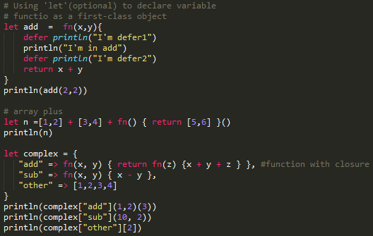

# Syntax Support for Sublime Text 3

This file provides Syntax highlighting support for the monkey Language in `Sublime Text 3`

## Sublime Text 3 screenshot

## Installation for Sublime Text 3

Just copy `monkey` directory to `%APPDATA%\Roaming\Sublime Text 3\Packages\User`.
e.g. in my computer, it's `C:\Users\huanghai\AppData\Roaming\Sublime Text 3\Packages\User`

## Known Issues

The same builtin reversed keywords(e.g. `println`) is not correctly
highlighted.