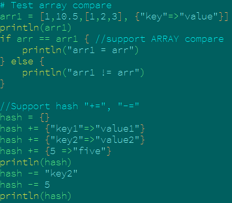

# Syntax Support for vim

This file provides Syntax highlighting support for the monkey Language in vim

## screenshot

## Installation for vim

Just copy `misc/vim` files to `$HOME/.vim/`'s corresponding directory.